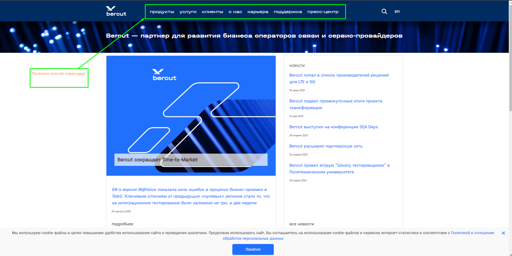
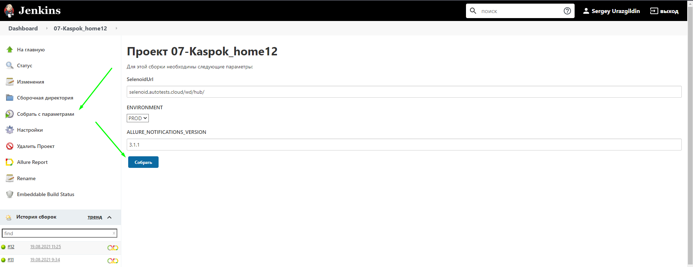
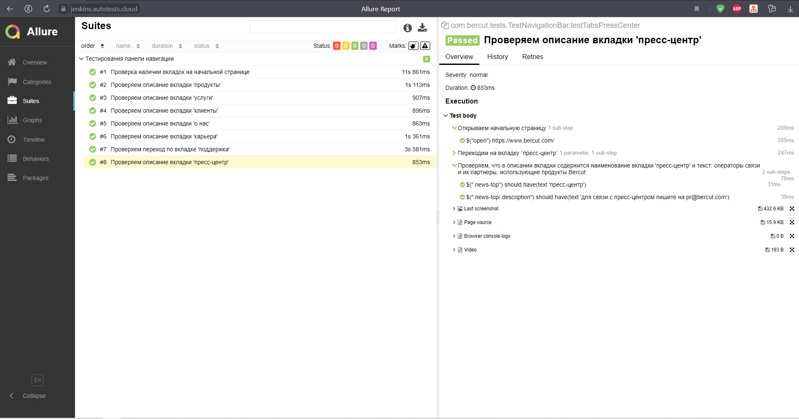
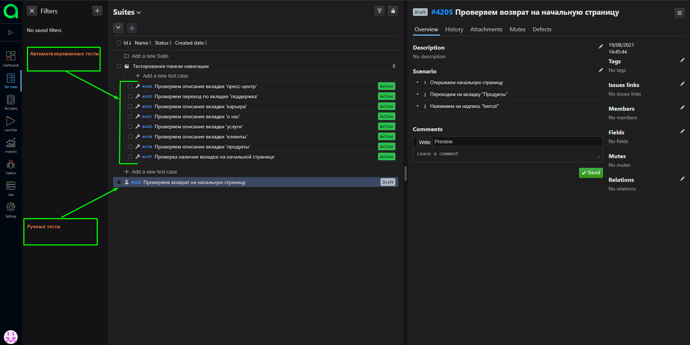
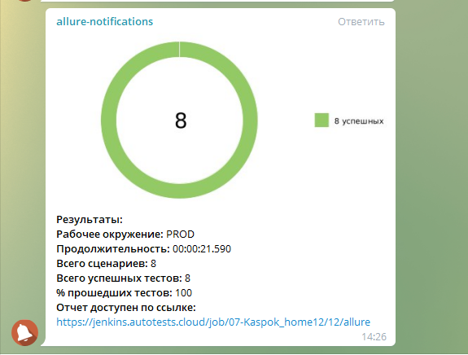

# Проверка панели навигации на сайте - https://www.bercut.com/


___

## Запуск тестов

#### Локальный запуск тестов через браузер:

Выполнить команду в терминале:

```bash
gradle clean test
```

___

#### Локальный запуск тестов через Selenoid:

Необходимо сделать:

1. Необходимо создать файл selenoidLoginPassword.properties - src/test/resources/config/selenoidLoginPassword.properties
2. Прописать в созданный файл:

```bash
   login=user1
   password=1234
```

3. Выполнить команду в терминале:

```bash
gradle clean test -DselenoidStatus=enabled
```

___

### Запуск тестов через Jenkins

1. Авторизоваться в [Jenkins](https://jenkins.autotests.cloud/)
2. Открыть [проект](https://jenkins.autotests.cloud/job/07-Kaspok_home12/build?delay=0sec)
3. Выбрать пункт "Собрать с параметрами"
4. Указать параметры или оставить параметры по умолчанию, нажать "Собрать"
   

___

## Результаты пройденных тестов

Сформировать отчет в Allure локально можно командой:

```bash
./gradlew allureServe
```

___

#### Анализ результатов в Allure после запуска тестов через Jenkins

Отчетом в Allure можно ознакомится по [ссылке](https://jenkins.autotests.cloud/job/07-Kaspok_home12/12/allure/#)

___

#### Анализ результатов в Allure TestOps


___

#### Уведомления в Telegram после пройденных тестов


___

#### Видео прохождения тестов


